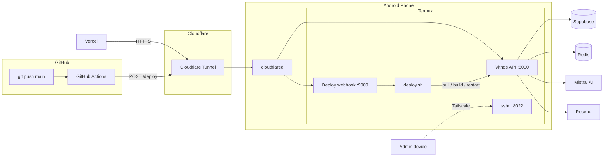

# nas-deploy

Infrastructure for running the Vithos backend on an Android device using Termux.

Turn an unused Android phone into a self-hosted backend node with automated deployments, public HTTPS access, remote administration, and uptime monitoring.

## Features

* **Always-on** — Starts automatically after reboot and keeps services running in the background.
* **Public HTTPS** — Cloudflare Tunnel exposes the API without port forwarding.
* **Automatic deployments** — GitHub Actions deploys every push to `main`.
* **Remote administration** — Tailscale + SSH provides private access from anywhere.
* **Process supervision** — Separate `tmux` sessions keep the API and infrastructure services running.
* **Hardware telemetry** — An authenticated endpoint exposes battery, storage, memory, and CPU load from the phone.
* **Uptime monitoring** — UptimeRobot monitors the API health endpoint.
* **Zero hosting cost** — Runs on existing hardware using free-tier infrastructure services.

The application itself lives in a separate repository. This repository contains only the scripts and configuration required to run and deploy it on the phone.

## Architecture



## How it works

### Public traffic

The API runs locally on the phone:

```text
localhost:8000
```

Cloudflare Tunnel creates an outbound connection from the phone to Cloudflare's edge. Requests to:

```text
https://nasbackend.vithos.in
```

are forwarded to the local API.

No inbound ports need to be opened on the home router, so the setup also works behind CGNAT.

The deployment webhook uses a separate hostname:

```text
https://deploynas.vithos.in
```

which forwards to:

```text
localhost:9000
```

### Deployments

A push to `main` triggers GitHub Actions.

The workflow sends an authenticated request to the deployment webhook:

```text
GitHub Actions
      │
      ▼
POST /deploy
      │
      ▼
webhook-server.js
      │
      ▼
deploy.sh
      │
      ├── git pull
      ├── pnpm install
      ├── pnpm build
      └── restart API
```

The deployment script uses `set -e`, so a failed install or build exits before the running API process is replaced.

The GitHub Actions job receives the deployment command's HTTP status and output.

### Process management

The phone uses separate `tmux` sessions for:

* `vitals` — Vithos API
* `tunnel` — Cloudflare Tunnel
* `webhook` — deployment webhook

This allows processes to continue running after an SSH session disconnects.

`Termux:Boot` runs `start-vithos.sh` after Android boots and recreates the required sessions.

### Remote administration

Tailscale provides private network access to the phone.

SSH is exposed only through the Tailscale network for administration:

```bash
ssh -p 8022 <user>@<tailscale-ip>
```

This is independent of the Cloudflare Tunnel, so SSH access does not depend on the public application tunnel.

### Hardware telemetry

The deployment webhook also exposes device metrics:

```text
GET /stats
```

This returns battery, storage, memory, and CPU load information read directly from the phone:

```json
{
  "battery": { "percentage": 87, "temperature": 31.2, "status": "CHARGING" },
  "storage": { "totalMB": 25600, "usedMB": 18200, "availableMB": 7400 },
  "memory": { "totalMB": 5820, "usedMB": 3110, "freeMB": 2710 },
  "load": { "1m": 0.15, "5m": 0.2, "15m": 0.18 }
}
```

Battery data requires the Termux:API app. Any command that fails or is unavailable (for example `free` without `procps` installed) resolves to `null` rather than failing the whole request.

The route is protected by the same `X-Deploy-Secret` header as `/deploy`.

## Repository layout

```text
nas-deploy/
├── start-vithos.sh
├── deploy.sh
├── webhook-server.js
├── .env.example
└── README.md
```

| File                | Description                                                                                                |
| ------------------- | ---------------------------------------------------------------------------------------------------------- |
| `start-vithos.sh`   | Boot script used by Termux:Boot. Acquires a wake lock, starts SSH, and creates the required tmux sessions. |
| `deploy.sh`         | Pulls the latest application code, installs dependencies, builds the application, and restarts the API.    |
| `webhook-server.js` | Minimal Node.js HTTP server that authenticates deployment requests and executes `deploy.sh`.               |
| `.env.example`      | Environment variable template for the deployment secret.                                                   |

## Requirements

### Hardware

* Android phone
* Wi-Fi or another persistent network connection
* Device capable of running Node.js through Termux
* Device connected to power for continuous operation

The reference setup uses an **Honor phone with 8 GB RAM**.

### Software

* Termux
* Termux:API
* Termux:Boot
* Node.js
* Git
* OpenSSH
* Corepack / pnpm
* Cloudflare account
* Tailscale account
* GitHub repository with Actions enabled

## Installation

### 1. Install Termux

Install Termux, Termux:API, and Termux:Boot from F-Droid.

Then install the required packages:

```bash
pkg update
pkg install nodejs-lts git openssh
```

Enable Corepack:

```bash
npm install -g corepack
corepack enable
```

The application repository's `packageManager` field should determine the pnpm version used during deployment.

Initialize SSH:

```bash
passwd
sshd
```

Termux's SSH server listens on port `8022` by default.

### 2. Clone this repository

```bash
git clone <repository-url> ~/nas/nas-deploy
cd ~/nas/nas-deploy
```

Create the environment file:

```bash
cp .env.example .env
```

Set the deployment secret:

```env
DEPLOY_SECRET=<random-secret>
```

Keep `.env` out of version control.

### 3. Configure the application

Clone the application repository to the location expected by `deploy.sh`.

The deployment script assumes the application is a Node.js project using pnpm and exposes the API through the configured port.

Adjust the paths and commands in `deploy.sh` if your application differs.

### 4. Configure startup

Create the Termux:Boot directory:

```bash
mkdir -p ~/.termux/boot
```

Create a symlink to the version-controlled boot script:

```bash
ln -s ~/nas/nas-deploy/start-vithos.sh \
      ~/.termux/boot/start-vithos.sh
```

The boot script starts:

1. SSH
2. the application
3. Cloudflare Tunnel
4. the deployment webhook

### 5. Prevent Android from stopping the services

Android may suspend or terminate Termux when the device is idle.

Acquire a wake lock:

```bash
termux-wake-lock
```

Also disable battery optimization for:

* Termux
* Termux:Boot
* Tailscale

On Honor devices, configure:

```text
Settings
→ Battery
→ App launch
→ Termux
```

Disable automatic management and allow:

* Auto-launch
* Secondary launch
* Run in background

Apply the same configuration to Termux:Boot and Tailscale.

Launch Termux:Boot manually once after installation so Android registers the application correctly for boot events.

### 6. Configure Cloudflare Tunnel

Install `cloudflared`:

```bash
pkg install cloudflared
```

Authenticate:

```bash
cloudflared tunnel login
```

Create a tunnel:

```bash
cloudflared tunnel create <tunnel-name>
```

Configure the hostnames to forward to the local services:

```text
nasbackend.vithos.in → localhost:8000
deploynas.vithos.in  → localhost:9000
```

Run the tunnel in its own tmux session:

```bash
tmux new-session -d -s tunnel 'cloudflared tunnel run <tunnel-name>'
```

The tunnel should also be started automatically by `start-vithos.sh`.

### 7. Configure GitHub Actions

Store the deployment secret as a repository secret:

```text
DEPLOY_SECRET
```

The workflow can then trigger deployments with:

```yaml
- name: Deploy
  run: |
    response=$(curl -s -w "\n%{http_code}" \
      --max-time 300 \
      -X POST \
      https://deploynas.vithos.in/deploy \
      -H "X-Deploy-Secret: ${{ secrets.DEPLOY_SECRET }}")

    http_code=$(echo "$response" | tail -n1)
    body=$(echo "$response" | sed '$d')

    echo "$body"

    if [ "$http_code" != "200" ]; then
      exit 1
    fi
```

The same secret must exist in the phone's `.env` file.

### 8. Configure Tailscale

Install Tailscale on the phone and on the devices used for administration.

Once connected, the phone can be accessed through its Tailscale address:

```bash
ssh -p 8022 <user>@<tailscale-ip>
```

No router port forwarding is required.

### 9. Configure monitoring

Create an HTTP monitor for:

```text
https://nasbackend.vithos.in/health
```

The `/health` endpoint should verify the API's required external dependencies rather than only checking whether the process is running.

## Deployment

Normal deployments require no manual interaction.

```text
git push origin main
        │
        ▼
GitHub Actions
        │
        ▼
Cloudflare Tunnel
        │
        ▼
webhook-server.js
        │
        ▼
deploy.sh
        │
        ├── git pull
        ├── pnpm install
        ├── pnpm build
        └── restart
```

To deploy manually from the phone:

```bash
cd ~/nas/nas-deploy
./deploy.sh
```

## Failure handling

The deployment process intentionally builds before restarting the running service.

```bash
set -e
```

If `pnpm install` or `pnpm build` fails, the script exits without restarting the existing API process.

This prevents a failed deployment from replacing a working version with an unbuildable one.

The three main access paths are also intentionally independent:

| Purpose             | Service           | Network               |
| ------------------- | ----------------- | --------------------- |
| Application traffic | Cloudflare Tunnel | Public HTTPS          |
| Deployments         | Cloudflare Tunnel | Public HTTPS + secret |
| Hardware telemetry  | Cloudflare Tunnel | Public HTTPS + secret |
| Administration      | Tailscale + SSH   | Private network       |
| Monitoring          | UptimeRobot       | Public HTTPS          |

## Security

The deployment endpoint is publicly reachable through Cloudflare, but deployment requests require the `X-Deploy-Secret` header.

The secret is stored in:

* GitHub Actions repository secrets
* the phone's git-ignored `.env`

It is never committed to the repository.

SSH is intended to be accessed through Tailscale rather than exposed through the public internet.

## Android compatibility

This setup relies on Android allowing Termux to remain active in the background.

Different manufacturers apply different background-process policies. The reference device is an Honor phone, where battery optimization and application-launch settings need to be configured explicitly.

If the API stops after several hours, check:

1. Battery optimization
2. Background execution permissions
3. Auto-launch permissions
4. Termux:Boot permissions
5. Whether the device has entered an aggressive power-saving mode
6. Whether the phone is connected to a stable power source

## Known issue: `adnanh/webhook`

The initial implementation used [`adnanh/webhook`](https://github.com/adnanh/webhook) as the deployment listener.

On the reference Android/Termux environment, the binary terminated with:

```text
SIGSYS
```

The failure was caused by Android's syscall restrictions interacting with the Go runtime's process execution path.

The webhook listener was therefore replaced with `webhook-server.js`, a small dependency-free Node.js HTTP server.

This also keeps the deployment endpoint implementation inside this repository rather than introducing another binary dependency.

## Why a phone?

For workloads that do not require significant CPU or memory, an unused Android phone can be a practical self-hosting node.

Advantages:

* Existing hardware
* Very low power consumption
* Built-in battery backup
* Wi-Fi connectivity
* No recurring compute cost
* Can operate behind CGNAT
* Easy physical access

Limitations:

* Android background-process restrictions
* Limited CPU/RAM compared with a VPS
* Storage reliability
* Wi-Fi dependency
* Device battery degradation
* Manufacturer-specific power management

This setup is intended for small services and personal infrastructure rather than workloads requiring production-grade compute, storage, or availability guarantees.


## License

This project is licensed under the MIT License. See [LICENSE](LICENSE) for details.
