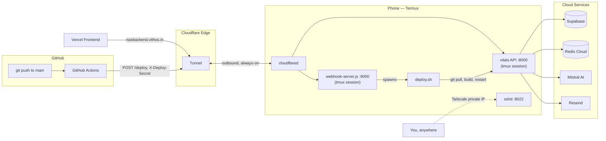

# nas-deploy

**Turning a spare 2018 Android phone into a free, always-on, CI/CD-deployed backend host.**

This repo holds the infrastructure scripts — not application code — for running the [Vithos](https://vithos.in)'s backup backend on an old 8GB Honor phone sitting on a shelf at home, instead of paying for a cloud host. The phone runs the actual Node.js API 24/7, reachable from the public internet, auto-deploys on every `git push`, and survives reboots, crashes, and Android's aggressive background-process killing.

Total hosting cost: **$0/month.** Everything here runs on free tiers (Cloudflare Tunnel, Tailscale, UptimeRobot) on top of hardware that was already sitting unused.

---

## Features

### 🏠 Always-on local server
The backend (`pnpm start`) runs inside [Termux](https://termux.dev) on the phone, supervised by `tmux` sessions that survive SSH disconnects, and auto-started on every boot via [Termux:Boot](https://github.com/termux/termux-boot). A `termux-wake-lock` plus Android battery-optimization exemptions keep it running even with the screen off.

### 🌍 Publicly reachable, zero port-forwarding
[Cloudflare Tunnel](https://developers.cloudflare.com/cloudflare-one/connections/connect-networks/) gives the phone a real public HTTPS hostname (`nasbackend.vithos.in`) without opening a single inbound port on the home router. The phone makes an *outbound* connection to Cloudflare's edge and keeps it open — this is what makes it work behind ordinary home NAT (or even CGNAT), unlike traditional dynamic-DNS + port-forwarding setups.

### 🚀 CI/CD auto-deploy
Every push to `main` triggers a GitHub Actions workflow that hits an authenticated webhook running on the phone, which pulls the latest code, rebuilds, and restarts the server — with the *real* build/deploy result (not just "request received") reported back into the Actions log.

### 🔐 Remote admin access from anywhere ([Tailscale](https://tailscale.com))
A private WireGuard mesh network between the phone and any of your own devices, giving the phone a permanent private IP reachable from anywhere in the world — independent of whatever local IP the phone's wifi happens to have. Deliberately kept **separate** from the Cloudflare Tunnel: if Cloudflare ever has an outage, you can still SSH into the phone to fix things, because admin access doesn't share a failure domain with the public app traffic.

### 📈 Uptime monitoring
[UptimeRobot](https://uptimerobot.com) polls the app's `/health` endpoint (which itself checks live Supabase and Redis connectivity, not just "is the process alive") and alerts on downtime — so a dropped connection is caught proactively instead of via a user complaint.

### 🧩 Infra kept separate from app code
This repo (`nas-deploy`) holds every phone-specific script — boot script, deploy script, webhook listener — entirely separate from the actual application repo. The app's source code has **zero** awareness it's running on a phone.

---

## Architecture



---

## Repo layout

| File | Purpose |
|---|---|
| `start-vithos.sh` | Run by Termux:Boot on every reboot. Acquires a wake lock, starts `sshd`, and brings up the `vitals`, `tunnel`, and `webhook` tmux sessions. Symlinked from `~/.termux/boot/start-vithos.sh`. |
| `deploy.sh` | Pulls latest `main`, `pnpm install && pnpm build`, then restarts only the `vitals` tmux session. Uses `set -e` — a broken build stops *before* touching the currently-running (working) session. |
| `webhook-server.js` | A ~30-line dependency-free Node HTTP listener on port 9000. Verifies `X-Deploy-Secret` with a timing-safe comparison, then runs `deploy.sh` synchronously and returns its real exit status + output. |
| `.env.example` | Template for the one secret this repo needs (`DEPLOY_SECRET`). The real `.env` is git-ignored and lives only on the phone. |

---

## Setup guide

### 1. Base Termux environment
- Install **Termux**, **Termux:API**, and **Termux:Boot** from F-Droid (not the Play Store build — it's been frozen since 2021).
- `pkg install nodejs-lts git openssh`
- `npm install -g corepack && corepack enable` — lets the exact `pnpm` version pinned in the app's `package.json` (`packageManager` field) run, matching its committed lockfile exactly, rather than whatever `pnpm` version happens to be newest.
- `passwd` to set a login password, then `sshd` to start SSH on port 8022.

### 2. Persistence (the hard part)
Android — and Honor's Magic UI in particular — aggressively kills backgrounded apps. Getting this phone to actually stay up required layering multiple fixes:
- `termux-wake-lock` (needs the Termux:API app) — prevents CPU sleep.
- Standard Android: **Settings → Apps → Termux → Battery → Unrestricted.**
- Honor-specific (the one that actually mattered most): **Settings → Battery → App launch → Termux** → turn off "Manage automatically" → enable Auto-launch / Secondary launch / Run in background. Repeat for **Termux:Boot** — it needs the same exemptions, separately.
- **Open the Termux:Boot app manually at least once** after installing it. Android won't deliver the boot-completed broadcast to an app it's never seen launched.
- Boot script lives at `~/nas/nas-deploy/start-vithos.sh`, symlinked into `~/.termux/boot/start-vithos.sh` so it stays version-controlled.

### 3. Public reachability
- `pkg install cloudflared`, `cloudflared tunnel login`, `cloudflared tunnel create <name>`.
- `cloudflared tunnel route dns <name> nasbackend.vithos.in` and again for `deploynas.vithos.in`.
- `~/.cloudflared/config.yml` maps both hostnames to their local ports (`8000` for the app, `9000` for the deploy webhook).
- Run with `cloudflared tunnel run` inside its own `tmux` session.

### 4. CI/CD
- `webhook-server.js` and `deploy.sh` live in this repo, cloned onto the phone.
- A GitHub Actions workflow (in the app repo) does one thing on push to `main`:
  ```yaml
  - run: |
      response=$(curl -s -w "\n%{http_code}" --max-time 300 -X POST https://deploynas.vithos.in/deploy \
        -H "X-Deploy-Secret: ${{ secrets.DEPLOY_SECRET }}")
      http_code=$(echo "$response" | tail -n1)
      body=$(echo "$response" | sed '$d')
      echo "$body"
      if [ "$http_code" != "200" ]; then exit 1; fi
  ```
- `DEPLOY_SECRET` is stored as a GitHub Actions repo secret **and** in a git-ignored `.env` on the phone — never committed.

> ⚠️ **Lesson learned the hard way:** the original webhook used the popular Go-based `adnanh/webhook` tool. It crashed with `SIGSYS` on every single trigger — Android's kernel seccomp filter blocks the `faccessat2` syscall that Go 1.21+'s `os/exec.LookPath` uses internally, and there's no way to configure around it. Swapped it for the tiny hand-rolled Node listener in this repo instead, since Node's own shell/exec path doesn't hit that syscall.

### 5. Remote admin access
- Install Tailscale on the phone (Play Store) and on your other devices, sign into the same account.
- `sshd` already listens on all interfaces, so it's automatically reachable on the phone's new Tailscale IP — no extra config.
- Same Honor battery/app-launch exemptions as step 2 apply to the Tailscale app too.

### 6. Monitoring
- Add an UptimeRobot monitor (free tier) pointed at `https://nasbackend.vithos.in/health`, checked every few minutes.

